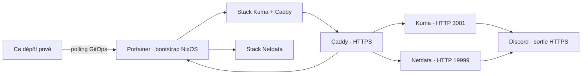

# Homelab applications

Ce dépôt privé est la source de vérité des applications Docker du homelab.
NixOS déclare l'hôte, Docker, le réseau et Portainer ; chaque dossier sous
`apps/` déclare une application déployée par Portainer depuis Git.

## Règles simples

- aucun secret, jeton, mot de passe, export ou donnée applicative dans Git ;
- une image est épinglée par tag **et** digest ;
- chaque application documente ses ports, volumes, sauvegarde et restauration ;
- les modifications passent par un commit relu puis par Portainer GitOps ;
- aucun service ne publie de port ou ne rejoint Internet par défaut.

## Applications présentes

- `uptime-kuma` : disponibilité des interfaces et services ;
- `netdata` : métriques temps réel de l'hôte, systemd et des workloads Docker.
- `homepage` : portail privé des services et liens du lab ; voir
  [le guide de déploiement](apps/homepage/README.md).

## Architecture et dépendances



Le proxy partage le cycle de vie du stack Kuma : l'arrêter affecte aussi les
accès Netdata et Portainer LAN proxifiés. Portainer via Tailscale relaie
directement son backend et ne dépend pas de Caddy.

| Guide | Rôle | État sensible |
| --- | --- | --- |
| [Kuma](apps/uptime-kuma/README.md) | Caddy, sondes, notifications | Comptes, webhook, CA Caddy |
| [Netdata](apps/netdata/README.md) | Hôte, systemd, cgroups | Montages hôte, état de l'agent |
| [Alerting Netdata](apps/netdata/ALERTING.md) | Règles ciblées, Discord | Secret hôte ; retest runtime requis |

Les sorties Discord sont explicites, pas limitées par une allowlist réseau.
Pas de socket Docker pour Kuma/Netdata ; Portainer est privilégié.

## Validation

Changer Git, relire puis faire autoriser l'activation avant publication sur une
branche suivie par GitOps. Ne pas modifier durablement dans l'éditeur Web.
Comparer révision récupérée, images, volumes et tests fonctionnels après déploiement.

```sh
git diff --check
docker compose -f apps/uptime-kuma/compose.yaml config --quiet
docker compose -f apps/netdata/compose.yaml config --quiet
```

```powershell
./apps/netdata/Test-AlertCoverage.ps1 -Offline
# Après déploiement, depuis le tailnet autorisé :
./apps/netdata/Test-AlertCoverage.ps1 -RequireDeployed
```

Lint ≠ santé runtime. Les configs non sensibles sont inline ; un chemin interne
Portainer n'est pas un bind hôte. Les dollars Netdata sont échappés et leur copie
contrôlée. Ne pas embarquer un secret dans configs.content.

## Dossier d'exploitation

Le dossier complet est dans le dépôt infrastructure **public**
[nixos-homelab-conf](https://github.com/sobekkkk/nixos-homelab-conf), sous docs/ :
architecture, réseau/TLS, GitOps, runbooks, état attesté, données et amorçage.
Ses branches documentaires ne sont pas nécessairement fusionnées sur main.
Ce dépôt privé conserve les détails propres aux stacks.

Sauvegardes différées au propriétaire. Git ne restaure pas données, secrets,
comptes et identités. Les outils de supervision partagent l'hôte : la panne
totale n'est pas garantie détectable. Un test Discord ne valide pas les seuils.
