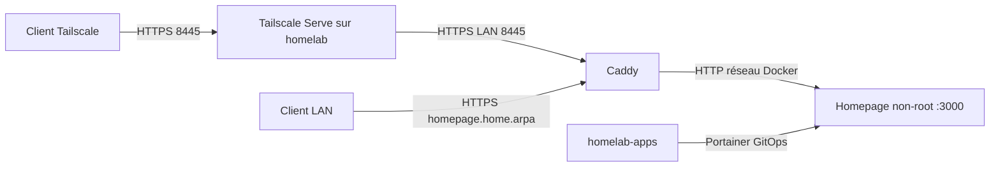

# Homepage — portail privé

État : configuration préparée, validation statique avant activation. Un commit
ne prouve pas que la stack est déployée. Homepage ne remplace ni Kuma ni Netdata.

## Accès prévus

- Tailscale : `https://homelab.tail239aaa.ts.net:8445/`.
- LAN : `https://homepage.home.arpa/`, ou `https://192.168.1.69:8445/`.
  Le certificat interne porte le nom du site ; privilégier le nom et installer
  l'autorité Caddy déjà utilisée par les autres services. L'accès par IP peut
  nécessiter un certificat adapté : ne pas désactiver TLS globalement.
- Aucun port hôte sur Homepage, aucune publication Internet ou Funnel.
- Les liens LAN exigent un DNS/hosts local pointant vers `192.168.1.69`.
  Le mapping NixOS de l'hôte ne configure pas automatiquement les appareils.

## Déploiement après autorisation

1. Fusionner les branches Homepage dans les deux dépôts.
2. Mettre à jour `/etc/nixos` puis exécuter le `nixos-rebuild test` documenté
   dans `docs/HOMEPAGE.md` du dépôt infrastructure. Ne pas switcher avant test.
3. Dans Portainer, créer une stack nommée **homepage**, méthode Repository :
   dépôt `https://github.com/sobekkkk/homelab-apps.git`, authentification de lecture
   du dépôt privé, référence `refs/heads/main`, chemin
   `apps/homepage/compose.yaml`, polling 15 minutes, administrateurs uniquement.
4. Mettre à jour la stack Kuma/Caddy existante depuis Git. Le conteneur Caddy
   peut être recréé ; brève interruption des interfaces proxifiées possible.
5. Vérifier le conteneur healthy et l'URL HTTPS, les six liens, puis tester
   Portainer/Kuma/Netdata pour détecter une régression. Persister NixOS ensuite.

Ne jamais créer une seconde stack Kuma : elle réutiliserait ses ports/volumes.
Ne jamais supprimer ses volumes pour appliquer la mise à jour.

## Sécurité et limites

Image v2.4.0 épinglée par digest, UID/GID 1000, racine en lecture seule,
capabilities supprimées, no-new-privileges, limites CPU/mémoire/PID et logs
bornés. Configurations inline montées en lecture seule ; tmpfs bornés pour
logs/cache. Pas de socket Docker, montage hôte, secret, widget authentifié,
icône distante ou service discovery. Les métriques restent dans Netdata.

La liste `HOMEPAGE_ALLOWED_HOSTS` n'est **pas** une authentification. Cette
première version repose sur l'identité Tailscale et un LAN de confiance ; tout
client autorisé à joindre le listener peut consulter les liens. Si le LAN
accueille des appareils non fiables, ajouter l'authentification de Homepage
avec secrets runtime avant activation. Le réseau partagé `homelab-proxy` permet
de joindre les autres backends et n'interdit pas les sorties Internet.

## Exploitation et retour arrière

Modifier les YAML inline dans Compose, relire le diff, valider avec
`docker compose -f apps/homepage/compose.yaml config --quiet`, committer puis
laisser Portainer réconcilier. Aucun secret ne doit entrer dans ces YAML.

Diagnostic privilégié par l'opérateur : `sudo docker ps --filter
label=com.docker.compose.service=homepage`, puis logs du nom réel affiché.
Un healthcheck vert ne prouve pas le routage HTTPS ; tester depuis un client.
Ne pas employer `docker exec homepage` sans vérifier le nom Compose réel.

Rollback : revert des commits applicatifs et infrastructure, redéploiement
Portainer et retour à la génération NixOS précédente si nécessaire. Ne pas
utiliser `tailscale serve reset` : cela supprimerait aussi les autres relais.
Pas de volume métier à sauvegarder ici : Git contient la configuration ; les
logs/cache en tmpfs sont éphémères. La CA Caddy reste dans son volume existant.

Sources : [Docker Homepage](https://gethomepage.dev/installation/docker/),
[configuration](https://gethomepage.dev/configs/settings/),
[version épinglée](https://github.com/gethomepage/homepage/releases/tag/v2.4.0).
